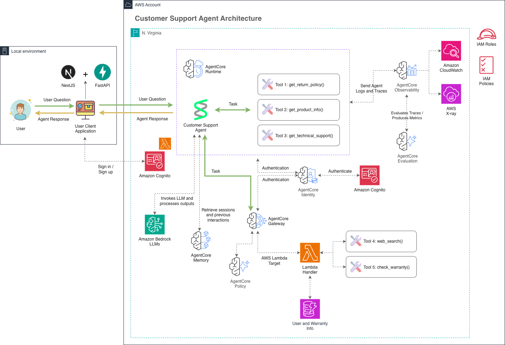

# Customer Support Agent — Amazon Bedrock AgentCore

A production-grade Customer Support Agent for **TechCorp**, an e-commerce company, built end-to-end on **Amazon Bedrock AgentCore** — with secure tool access via AgentCore Gateway, persistent memory, Cedar-based authorization, and a web chat interface on top.

This is not a toy chatbot demo: the entire stack — Runtime, Gateway, Memory, Knowledge Base, authentication, and authorization — is provisioned as code and designed to mirror how this would actually run in production.

> Based on the AWS workshop [Getting started with Amazon Bedrock AgentCore](https://catalog.us-east-1.prod.workshops.aws/workshops/850fcd5c-fd1f-48d7-932c-ad9babede979/en-US) — this repository reimplements its labs as Terraform-managed infrastructure (instead of notebook-driven SDK calls) and replaces the reference Streamlit client with the Next.js + FastAPI app described below. The modified lab structure is located in `src/notebooks/`.

## Table of contents

- [Overview](#overview)
- [Architecture](#architecture)
- [Features](#features)
- [Tech stack](#tech-stack)
- [Project structure](#project-structure)
- [Prerequisites](#prerequisites)
- [Getting started](#getting-started)
- [Trying it out](#trying-it-out)
- [Observability](#observability)
- [Security model](#security-model)
- [Documentation map](#documentation-map)
- [References](#references)

## Overview

Customers contact TechCorp support for product specs, return/warranty policy questions, warranty status lookups, and technical troubleshooting. This agent handles those requests automatically:

- Looks up real product, warranty, and customer data instead of guessing
- Remembers customer preferences and prior context across turns (and across sessions)
- Searches the web for up-to-date information when its own knowledge isn't enough
- Enforces fine-grained, auditable authorization on every tool call

## Architecture



**Request flow:**

1. **Local environment → AgentCore Runtime.** The user's question reaches the Runtime as an HTTP request. In this repo, our **Next.js frontend**, which calls the **FastAPI backend**, forwards the request to the Runtime's data-plane API with a JWT bearer token (`Authorization` header).
2. **AgentCore Identity ↔ Amazon Cognito.** Both the Runtime and the Gateway validate that JWT against a `CUSTOM_JWT` authorizer backed by Cognito (`MCPServerPool` — `iac/modules/cognito_lab`). The backend (`backend/app/services/cognito_auth.py`) supplies this token two ways: a real logged-in user's own JWT (register/login via SRP, `/api/auth/*`), or — when no user is logged in — a shared service identity (`testuser`) authenticated once and cached.
3. **Customer Support Agent (inside AgentCore Runtime).** A Strands agent (`src/customer_support_agent/main.py`) runs three in-process tools directly — `get_return_policy()`, `get_product_info()`, `get_technical_support()` — the first two are static lookups, the third retrieves from the **Knowledge Base** (S3 Vectors, seeded with product guides).
4. **Invokes LLM.** The agent calls **Amazon Bedrock LLMs** to reason over the user's question and decide which tool(s) to use.
5. **AgentCore Memory.** Before/after each turn, the agent retrieves and stores session history and long-term preferences (semantic + user-preference strategies), keyed by `session_id`/`actor_id` — this is what gives the agent continuity across messages in the same conversation.
6. **AgentCore Gateway → AWS Lambda Target.** Anything that needs to live outside the container goes through the Gateway as MCP tools: `web_search()` and `check_warranty()`, both implemented by a single **Lambda function** (`iac/modules/lambda`) that queries **DynamoDB** for warranty/customer records.
7. **AgentCore Policy.** Every Gateway tool call is evaluated against **Cedar policies** (`iac/modules/bedrock_agentcore_gateway`) before it's allowed to execute — e.g. only a tagged principal can call `check_warranty`, and `web_search` is conditionally denied for specific query content. This is authorization on top of (not instead of) IAM.
8. **AgentCore Observability → Evaluation.** The Runtime, Gateway, and Memory all send traces to **AgentCore Observability** (CloudWatch + X-Ray), which **AgentCore Evaluation** consumes to produce quality/performance metrics — see [Observability](#observability) below for what's actually wired up in Terraform.

## Features

| Capability | How it's implemented |
|---|---|
| Product info & return policy | In-process tools (`agent_helpers/strands_agent.py`) |
| Warranty status lookup | DynamoDB-backed tool exposed via AgentCore Gateway (MCP) |
| Technical troubleshooting | Bedrock Knowledge Base (S3 Vectors) seeded with product guides |
| Web search | DuckDuckGo search tool, also exposed via the Gateway |
| Conversation memory | AgentCore Memory — semantic + user-preference strategies, persisted per session |
| Fine-grained authorization | Cedar policies on the AgentCore Policy Engine (allow/deny per tool, per principal) |
| Authentication | Cognito JWT (`CUSTOM_JWT` authorizer) on both the Gateway and the Runtime |
| Observability | CloudWatch vended logs + X-Ray traces for Gateway, Memory, and Runtime |
| Chat UI | Next.js + Tailwind, multi-conversation sidebar, per-user login/registration |

## Tech stack

| Layer | Technology |
|---|---|
| Infrastructure as Code | Terraform `>= 1.9`, AWS provider `~> 6.0` |
| Agent runtime | Amazon Bedrock AgentCore (Runtime, Gateway, Memory, Knowledge Base, Policy Engine) |
| Agent framework | [Strands Agents](https://strandsagents.com/) (Python) |
| Backend API | FastAPI + boto3 + httpx |
| Frontend | Next.js 15 (App Router) + TypeScript + Tailwind CSS |
| Data | DynamoDB (warranty, customer profile), S3 Vectors (Knowledge Base) |
| Auth | Amazon Cognito (User Pools, OAuth2) |
| Containers | Docker, Docker Compose |

## Project structure

```
.
├── iac/                          # Terraform — all AWS infrastructure
│   └── modules/
│       ├── iam/                       # Managed policies, lab role
│       ├── ecr/                       # Container registry for the agent image
│       ├── s3/                        # Artifacts + Knowledge Base data buckets
│       ├── dynamodb/                  # warranty + customer-profile tables (seeded)
│       ├── lambda/                    # Warranty lookup + web search tool function
│       ├── cognito/                   # Production User Pool (web + machine OAuth2 clients)
│       ├── cognito_lab/               # MCPServerPool — service identity used by the Gateway/Runtime/backend
│       ├── bedrock_agentcore_gateway/ # Gateway + Gateway Target + Policy Engine + Cedar policies
│       ├── bedrock_kb/                # Knowledge Base (S3 Vectors) + seeded docs
│       ├── bedrock_agentcore_memory/  # Long-term + short-term memory, with observability
│       ├── bedrock_agentcore_runtime/ # The deployed agent container + observability
│       ├── bedrock_agentcore_evaluation/ # Online Evaluation Config — continuous quality monitoring
│       └── cloudwatch/                # Bedrock Model Invocation Logging destination
├── src/
│   ├── customer_support_agent/   # The agent — deployed as a container to AgentCore Runtime
│   │   ├── main.py                    # AgentCore Runtime entrypoint
│   │   └── agent_helpers/             # Tools, memory config, shared boto3/SSM helpers
│   └── notebooks/                # 7 Jupyter labs walking through this same stack step by step
│       ├── lab-01-create-an-agent.ipynb       … lab-07-cleanup.ipynb
│       └── lab_helpers/                        # Shared boto3/SSM helpers used across labs
├── docker/                       # Dockerfile + requirements.txt for the agent container
├── docs/
│   ├── images/                   # Assets/images used by the documentation
│   ├── DEPLOYMENT_GUIDE.md       # Full infra deployment walkthrough
├── backend/                      # FastAPI — bridges the frontend to the AgentCore Runtime
├── frontend/                     # Next.js + Tailwind — chat UI
├── docker-compose.yml            # Runs backend + frontend together
├── pyproject.toml                # Python deps for running the notebooks locally
└── README.md                     # You are here
```

## Prerequisites

| Tool | Notes |
|---|---|
| Terraform | `>= 1.9` |
| AWS CLI v2 | configured with a named profile that has the permissions in `iac/modules/iam` |
| Docker + Docker Compose | for building/running the agent image and the app |
| Node.js | `>= 18` (only needed for native frontend development, not for Docker Compose) |
| Python | `>= 3.12` (only needed for native backend development) |

## Getting started

### 1. Deploy the AWS infrastructure

The entire AgentCore stack (Runtime, Gateway, Memory, Knowledge Base, Cognito, DynamoDB, IAM) is provisioned by Terraform — see **[DEPLOYMENT_GUIDE.md](./docs/DEPLOYMENT_GUIDE.md)** for the full two-phase deployment (build/push the agent image, then `terraform apply`).

```bash
cd iac
cp terraform.tfvars.example terraform.tfvars   # fill in your AWS profile, region, model ID
terraform init
terraform apply -target=module.ecr
# build & push the agent image — see DEPLOYMENT_GUIDE.md
terraform apply
```

### 2. Run the chat application

#### Option A — Docker Compose (recommended)

```bash
cd ..
cp .env.example .env   # set AWS_PROFILE / AWS_REGION if different from the defaults
docker compose up --build
```

- Frontend: `http://localhost:3000`
- Backend: `http://localhost:8000` (`/api/health` for a quick check)
    * `/api/health` for a quick check
    * `/docs` for api documentation
    * `/redoc` for api in OpenAPI specification

The backend container authenticates to AWS using the profile named in `.env`, mounting your host's `~/.aws` directory read-only — no credentials are baked into the image. Stop everything with `docker compose down`.

#### Option B — Run natively

**Backend (FastAPI):**

```bash
cd backend
python3 -m venv .venv && source .venv/bin/activate
pip install -r requirements.txt
cp .env.example .env   # optional — override config.yaml values (AWS profile, region, etc.)
uvicorn app.main:app --reload --port 8000
```

See [BACKEND.md](docs/BACKEND.md) for configuration details and how authentication to the Runtime works.


**Frontend (Next.js)**, in a separate terminal:

```bash
cd frontend
npm install
cp .env.local.example .env.local
npm run dev
```

See [FRONTEND.md](docs/FRONTEND.md) for more details.


### Optional: step-by-step notebooks

`src/notebooks/` has 7 Jupyter labs that walk through the same stack incrementally — agent prototype, memory, Gateway/identity, Runtime deployment, online evaluation, the frontend, and cleanup. They read every resource identifier from SSM (the same parameters Terraform publishes above), so run them anytime after `terraform apply`:

```bash
# We need to be located in the root of the project
python3 -m venv .venv && source .venv/bin/activate
pip install -e .              # installs from pyproject.toml
uv run --active --with jupyter jupyter lab src/notebooks
```

## Trying it out

Once both services are running, open `http://localhost:3000` and ask things like:

- *"What's your return policy for laptops?"*
- *"I have a Gaming Console Pro, serial MNO33333333 — is it still under warranty?"*
- *"My laptop keeps overheating and restarting, what should I check?"*
- *"Search the web for the latest Samsung Galaxy S24 specs"*

The frontend requires logging in (or registering) with a MCPServerPool Cognito account before chatting. Each logged-in user keeps their own conversation history (left sidebar, persisted per username), with full AgentCore Memory continuity per conversation and personalization tied to that user's identity.

## Observability

- **Gateway, Memory, and Runtime** all vend structured `APPLICATION_LOGS` (and `USAGE_LOGS` for Runtime) to CloudWatch Logs, plus `TRACES` to X-Ray, via `aws_cloudwatch_log_delivery*` resources in their respective Terraform modules.
- **CloudWatch Transaction Search** is the account-level prerequisite for runtime/agent spans (`aws/spans` log group).
- **Bedrock Model Invocation Logging** has its destination log group and IAM role provisioned by `modules/cloudwatch` (must be wired up manually in the Bedrock console — see that module's output values).

## Security model

- **Least-privilege per module** — each Terraform module's IAM role only grants what that specific resource needs (e.g. the Gateway role can invoke the warranty Lambda and access the Policy Engine; the Runtime role can read Memory and invoke the Gateway).
- **Cedar authorization** on the Gateway — every tool call is evaluated against allow/deny policies (e.g. tool access scoped to a tagged principal, conditional deny rules) before it's permitted, independent of IAM.
- **Two separate Cognito pools, deliberately**: `modules/cognito` (production-style User Pool with web/machine OAuth2 clients, hosted UI) and `modules/cognito_lab` (`MCPServerPool`, the only pool the Gateway/Runtime JWT authorizers trust — backs both the backend's shared service identity and real per-user register/login). They are intentionally isolated to avoid SSM parameter collisions and unintended cross-pool token reuse.
- **No AWS credentials in the browser** — the frontend only ever talks to the FastAPI backend.

## Documentation map

| Document | Covers |
|---|---|
| [DEPLOYMENT_GUIDE.md](docs/DEPLOYMENT_GUIDE.md) | Full infrastructure deployment (two-phase Terraform + image build/push), resource reference, troubleshooting, teardown |
| [BACKEND.md](docs/BACKEND.md) | Backend configuration, authentication flow, API reference |
| [FRONTEND.md](docs/FRONTEND.md) | Frontend setup and environment variables |
| [src/notebooks/](src/notebooks/) | 7 step-by-step Jupyter labs covering the same stack (agent, memory, Gateway, Runtime, evaluation, frontend, cleanup) |

## References

- [Getting started with Amazon Bedrock AgentCore](https://catalog.us-east-1.prod.workshops.aws/workshops/850fcd5c-fd1f-48d7-932c-ad9babede979/en-US) — the original AWS workshop this project is based on.
- [Icons8](https://icons8.com/icons) — source of some of the icons used in the architecture diagram (`docs/images/architecture.png`).
