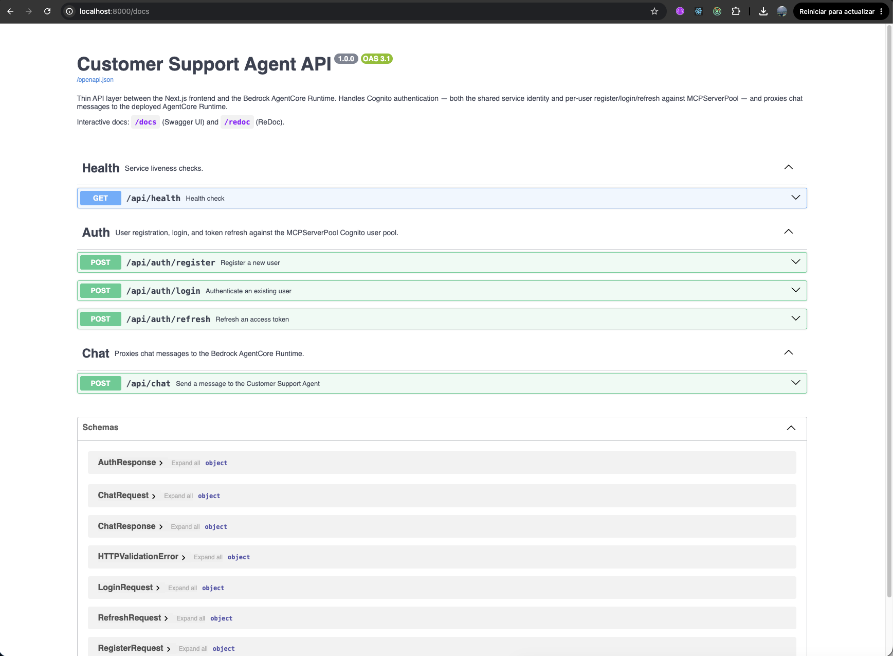
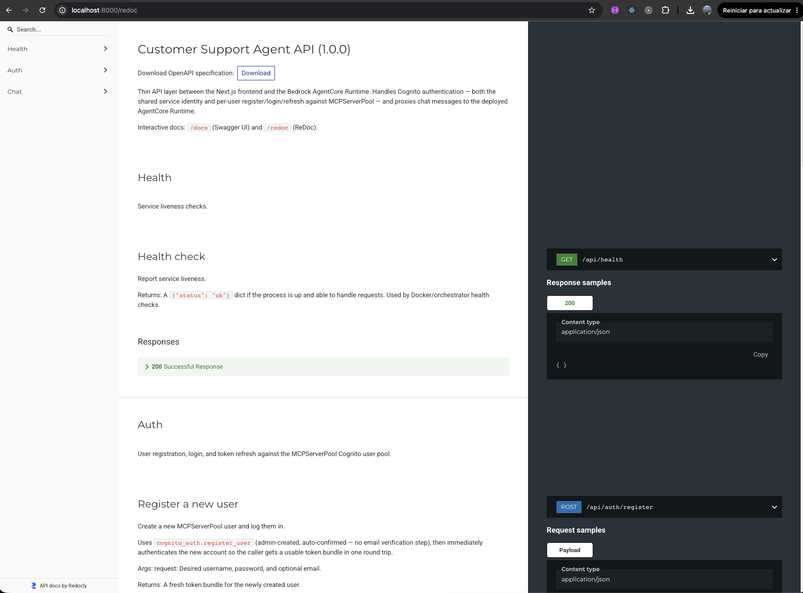

# Customer Support Agent — Backend (FastAPI)

Thin API layer between the Next.js frontend and the Bedrock AgentCore Runtime
deployed via `iac/modules/bedrock_agentcore_runtime`.

## Project structure

```
app/
  main.py              # FastAPI app factory, middleware, router registration
  core/
    config.py           # pydantic-settings (config.yaml + env var overrides)
    logging.py           # logging setup
  api/routes/            # HTTP endpoints (the API "interface" layer)
    health.py
    auth.py
    chat.py
  models/                 # Pydantic request/response schemas
    auth.py
    chat.py
  services/                # business logic / AWS integrations
    cognito_auth.py          # MCPServerPool: shared identity + per-user register/login/refresh
    agentcore_client.py       # Bedrock AgentCore Runtime data-plane client
  utils/                      # generic, reusable helpers
    aws.py                      # boto3 session + SSM parameter lookup
    security.py                  # Cognito SECRET_HASH computation
```

## API documentation

Once running, interactive API docs are available at:

- **Swagger UI**: `http://localhost:8000/docs`
- **ReDoc**: `http://localhost:8000/redoc`
- **OpenAPI schema**: `http://localhost:8000/openapi.json`





## How it works

- The Runtime requires a JWT bearer token (`CUSTOM_JWT` authorizer against
  `MCPServerPool`). Two identities can supply that token:
  - **Per-user** (`/api/auth/register`, `/api/auth/login`): real users
    authenticated via SRP against MCPServerPool. Their own access token is
    sent as `ChatRequest.access_token`, and their username doubles as the
    AgentCore Memory `actor_id` for personalization.
  - **Shared service identity** (`testuser`): used as a fallback when a chat
    request has no `access_token` — same approach as
    `get_or_create_cognito_pool()` in the project's notebooks. Cached in
    memory and refreshed automatically before it expires.
- All AWS resource identifiers (Runtime ARN, Cognito pool/client ID/secret,
  discovery URL) are read from SSM at request time / startup, using the
  parameter names published by Terraform — never hardcoded.

## Configuration

Edit `config.yaml`, or override any value with an environment variable using
a `__` path delimiter (see `.env.example`):

```bash
cp .env.example .env
# edit .env if you need to override the AWS profile, region, or test password
```

## Run locally

```bash
cd backend
python3 -m venv .venv && source .venv/bin/activate
pip install -r requirements.txt
uvicorn app.main:app --reload --port 8000
```

The API is then available at `http://localhost:8000` — see `/docs` for the
full interactive reference. Summary:

- `GET /api/health` — health check
- `POST /api/auth/register` — `{ username, password, email? }` → token bundle
- `POST /api/auth/login` — `{ username, password }` → token bundle
- `POST /api/auth/refresh` — `{ username, refresh_token }` → token bundle
- `POST /api/chat` — `{ message, session_id?, actor_id?, access_token? }` → `{ response, session_id, actor_id }`

## Prerequisites

The Terraform stack in `iac/` must already be applied — this backend reads
the Runtime ARN and MCPServerPool credentials from SSM parameters that only
exist after `terraform apply` (see `../DEPLOYMENT_GUIDE.md`).
