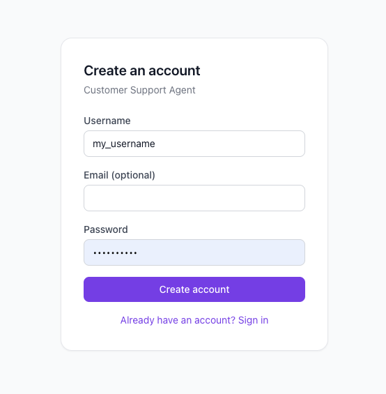
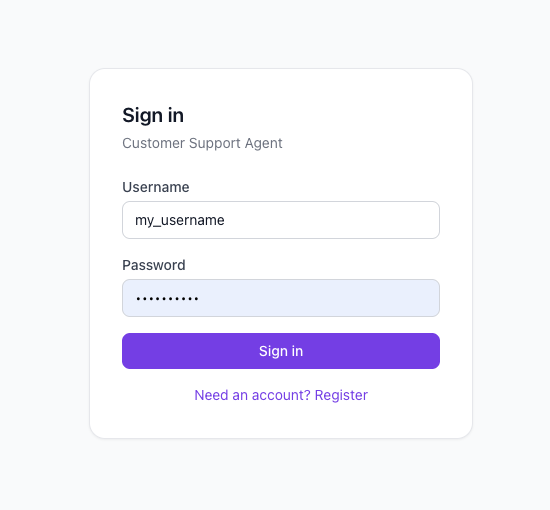
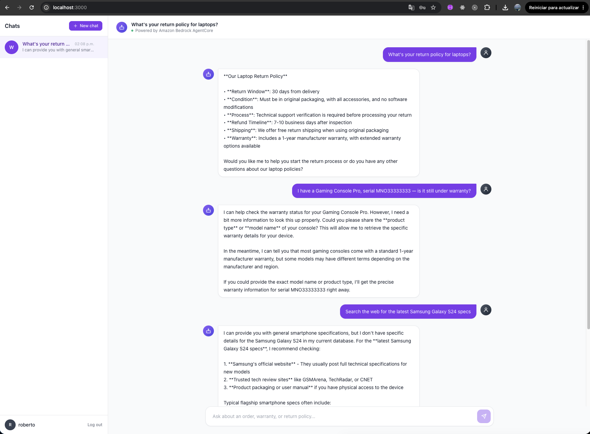
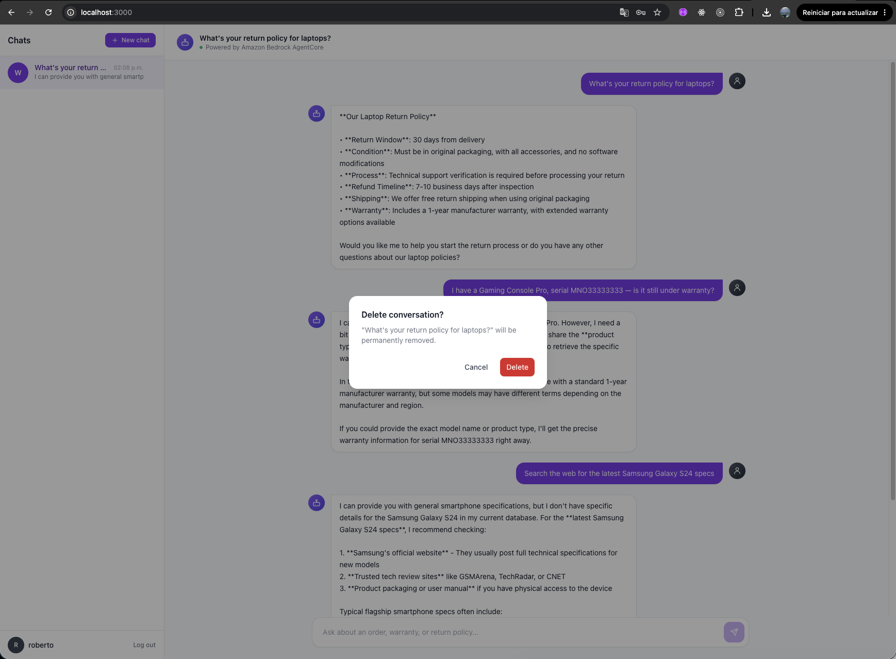

# Customer Support Agent — Frontend (Next.js + Tailwind)

A chat UI interface for the TechCorp customer support agent.
Talks only to the FastAPI backend in `../backend` — it never calls AWS
directly (no AWS credentials live in the browser).

## Project structure

```
app/
  page.tsx                 # Auth gate: renders AuthForm or ChatApp
  layout.tsx, globals.css
components/
  AuthForm.tsx               # Combined login/register screen
  ChatApp.tsx                 # Top-level chat orchestrator (conversations, sending)
  Sidebar.tsx                  # Conversation list, new chat, delete, logout
  ChatWindow.tsx, ChatInput.tsx, MessageBubble.tsx, TypingIndicator.tsx, Avatar.tsx, icons.tsx
  ConfirmDialog.tsx             # Reusable confirmation modal (e.g. delete conversation)
lib/
  auth.ts                       # login/register/refresh, sessionStorage session persistence
  api.ts                         # sendMessage() — POST /api/chat
  conversations.ts                # Per-user conversation persistence (localStorage)
  types.ts                         # ChatMessage / Conversation types
```

## Run locally

```bash
cd frontend
npm install
cp .env.local.example .env.local
npm run dev
```

Open `http://localhost:3000`. Make sure the backend is running first (see
`../backend/README.md`) and that `NEXT_PUBLIC_API_BASE_URL` in `.env.local`
points at it.









## How it works

- **Authentication.** On load, `app/page.tsx` checks `sessionStorage` for a
  saved session; if none, it shows `AuthForm` (login or register, toggled in
  the same screen). Registering or logging in calls the backend
  (`/api/auth/register` / `/api/auth/login`), which authenticates against
  the **MCPServerPool** Cognito pool — the same pool the AgentCore
  Runtime/Gateway JWT authorizers trust. The resulting tokens are kept in
  `sessionStorage` (cleared when the tab closes) and the access token is
  refreshed automatically (`/api/auth/refresh`) shortly before it expires.
- **Conversations.** Each sidebar entry is its own conversation, and its id
  doubles as the AgentCore session id — memory continuity is tied 1:1 to a
  sidebar entry, no separate id to track. Conversations are persisted in
  `localStorage`, namespaced per logged-in username
  (`customer-support-conversations:{username}`), so different users sharing
  a browser never see each other's chats. "New chat" starts a fresh entry;
  the trash icon on hover opens a `ConfirmDialog` to delete one (only
  removes it from the sidebar — it doesn't delete the underlying AgentCore
  Memory session).
- **Sending a message** (`ChatApp.handleSend`) posts to the backend's
  `POST /api/chat` with the message, the conversation id as `session_id`,
  and the logged-in user's `access_token`/username (as `actor_id`) so
  AgentCore Memory personalizes responses per user.
- **Logout** clears the `sessionStorage` session; conversations stay in
  `localStorage` under that username for the next time they log back in.

## Notes

- Responses are request/response (non-streaming) for now — the deployed
  agent (`src/customer_support_agent/main.py`) returns a complete response
  rather than streaming tokens.
- No backend route exists for deleting AgentCore Memory sessions, so
  deleting a conversation here only affects the local sidebar list.
